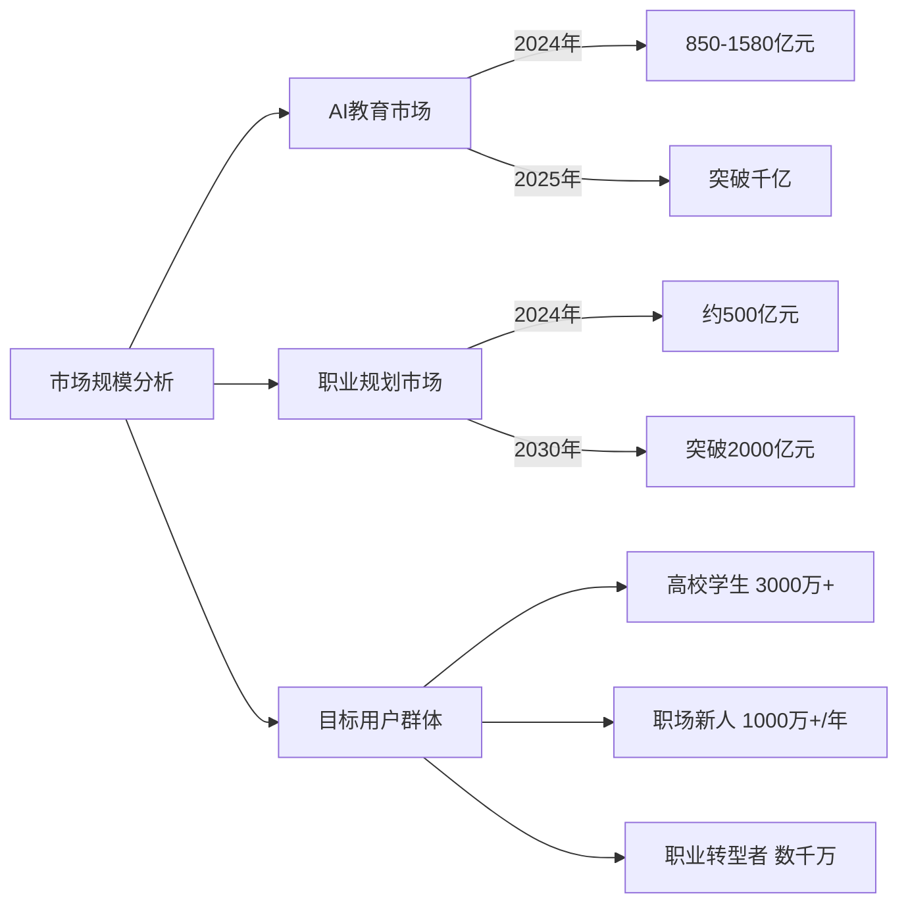
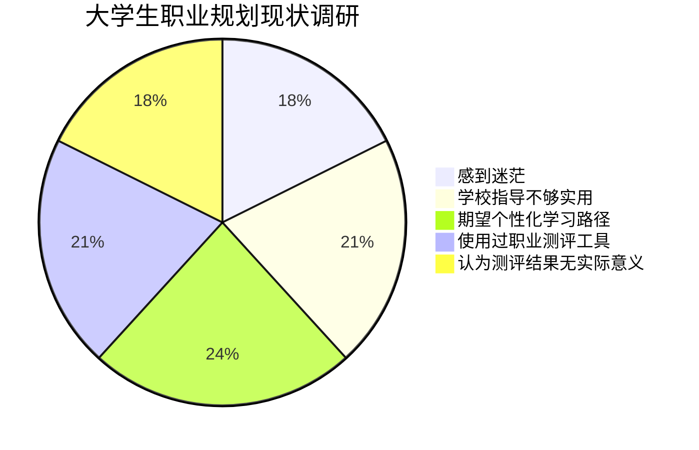
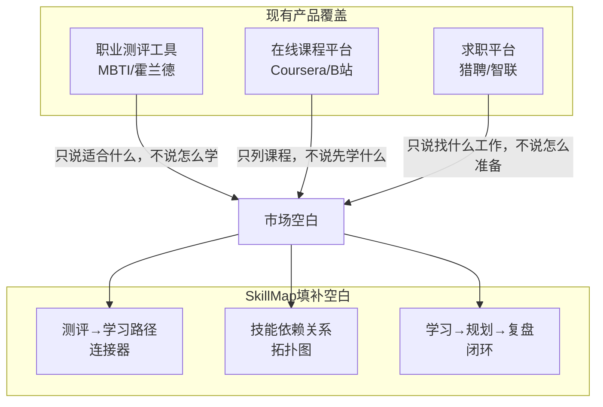
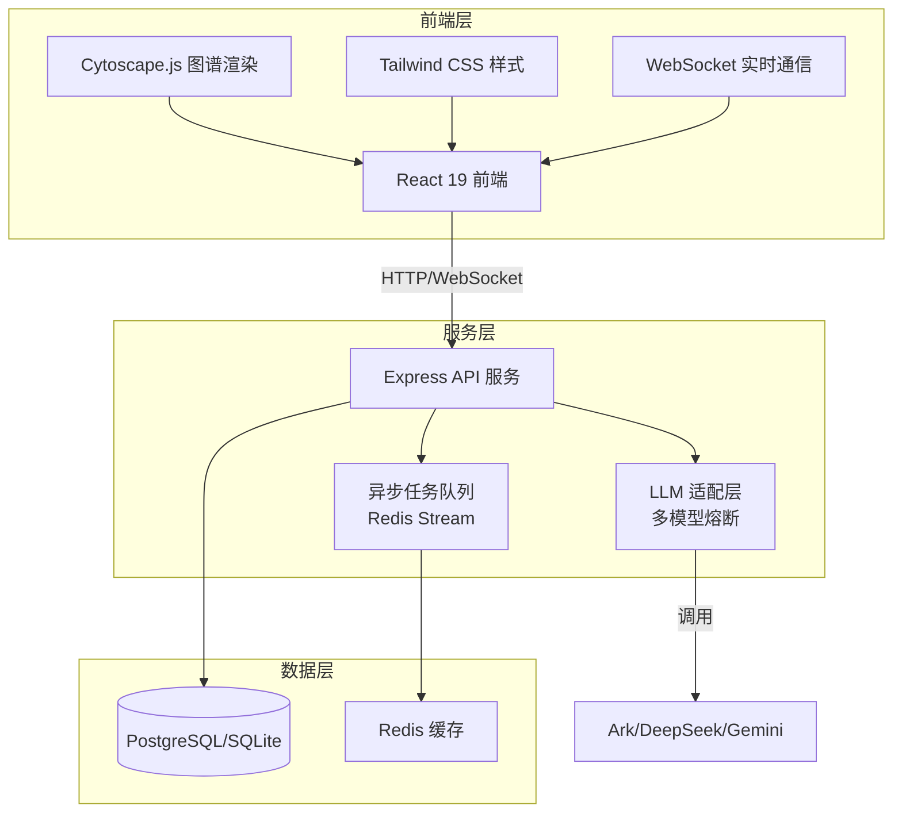
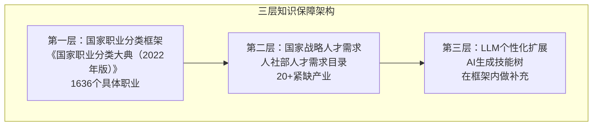
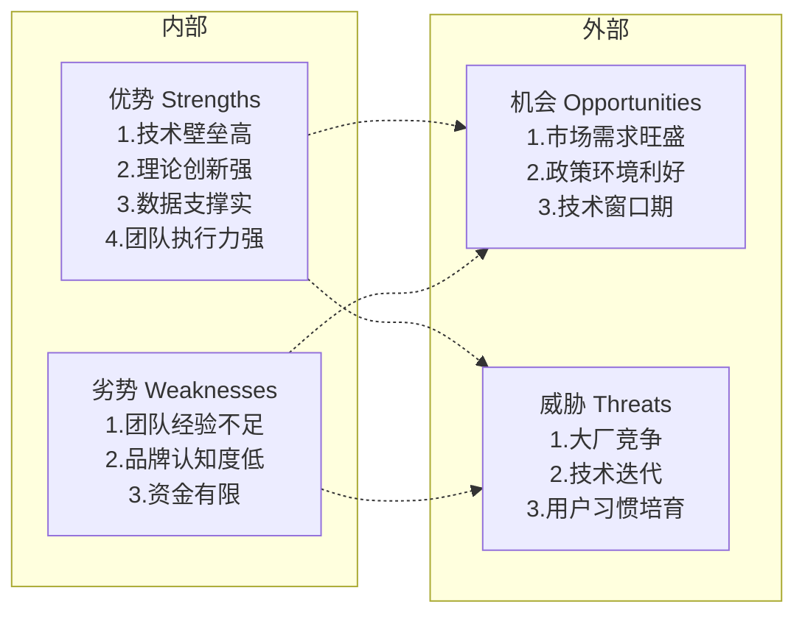
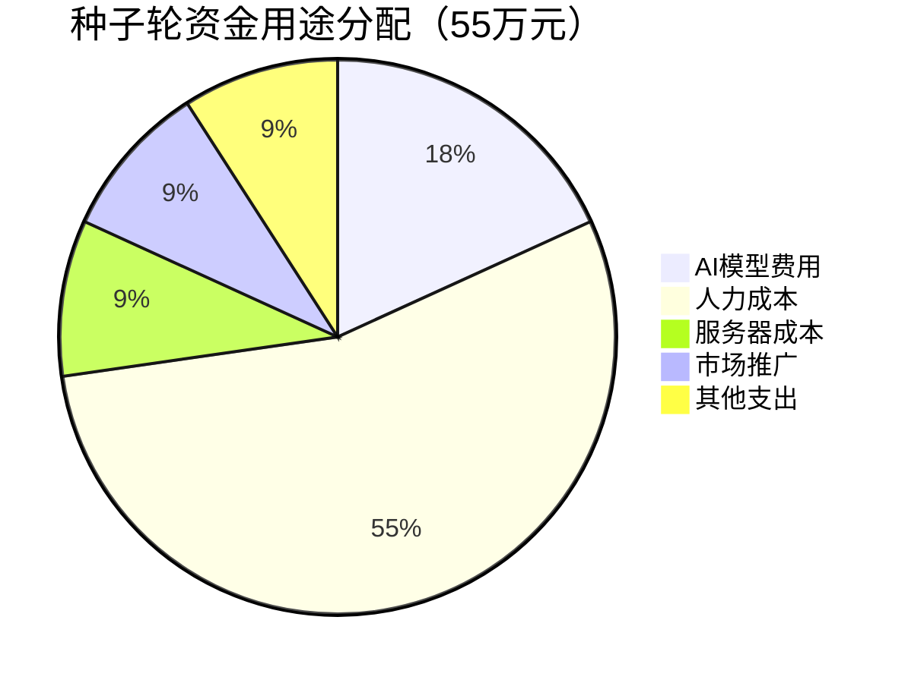

# SkillMap 商业计划书

**项目名称：** SkillMap —— AI 时代的个人成长导航系统

**参赛赛道：** "人工智能+"项目 | 本科生创意组

---

## 项目概要

### 一句话亮点

> **SkillMap：连接"测评 → 规划 → 学习 → 复盘"完整闭环，让3000万大学生不再迷失学习方向。**

### 核心问题

你是否见过这样的场景？一个计算机专业的大二学生，对着培养方案上的课程列表发呆。他知道毕业后想成为前端工程师，但面对HTML、CSS、JavaScript、React、Vue、Node.js这些密密麻麻的课程，他完全不知道该从哪开始，更不知道这些技能之间有什么依赖关系。

这不是个例。根据麦可思研究院的调研数据，超过60%的大学生对自己的职业规划感到迷茫，超过70%的学生认为学校的职业指导"不够实用"。他们最常问的一个问题是：**"我想成为XX，但我不知道该学什么、先学什么、后学什么？"**

### 解决方案

SkillMap 的核心创新在于：我们不是又一个AI对话机器人，也不是又一个职业测评工具——我们填补了从"知道方向"到"走到目标"之间的市场空白。

用户只需要输入三个信息：专业背景、目标职业、当前水平。我们的AI系统就会自动生成一棵包含25-40个节点的个性化技能树，清晰展示技能之间的依赖关系。用户可以围绕每个技能节点与AI进行深度对话复盘，可以追踪自己的学习进度，可以规划未来的职业发展路径。

### 三大核心优势

**第一，技术壁垒高。** 我们自主研发了多项技术创新：多模型熔断切换机制确保服务高可用；异步任务队列+WebSocket实时推送解决长耗时问题；JSON增量解析+自动修复引擎攻克LLM输出不稳定的行业难题；三层知识保障架构（国家职业分类+人才需求目录+LLM扩展）确保AI生成内容有据可查。

**第二，理论创新强。** 我们构建了中西融合的中国特色生涯规划体系，融合Holland Code、Career Anchors等西方理论，与"立德树人""家国情怀""人才强国"等中国特色理念，形成"个人—社会—国家"三位一体的评估框架。

**第三，数据支撑实。** 我们接入《国家职业分类大典（2022年版）》1636个职业数据，以及人社部、粤港澳大湾区人才需求目录，确保职业信息和技能要求与国家权威标准保持一致。

### 市场机会

根据博研咨询数据，中国AI教育市场2024年规模已达850-1580亿元，预计2025年突破千亿。职业规划咨询市场2024年约500亿元，预计2030年突破2000亿元，年复合增长率超过15%。我们的目标用户是3000万+在校大学生，加上职场新人和职业转型者，市场空间巨大。


*数据来源：博研咨询《2025年中国AI+教育行业市场前景预测报告》、QYResearch《全球职业咨询服务市场研究报告》*

### 团队能力

团队具备全栈开发能力，200+源文件TypeScript全栈代码，30+REST API，6种AI模型支持，6层安全防护机制，完整的项目文档体系。我们是真正能把这件事做成的团队。

---

## 第一章 市场分析

### 1.1 项目背景

当前，我国正处于从"人口红利"向"人才红利"转型的关键阶段。党的二十大报告明确提出"教育、科技、人才是全面建设社会主义现代化国家的基础性、战略性支撑"。教育部《教育强国建设规划纲要（2024—2035年）》强调要"构建中国特色生涯教育体系"，帮助学生"解决好培养什么人、怎样培养人、为谁培养人这个根本问题"。

与此同时，人工智能技术正在深刻改变教育领域。《"人工智能+教育"行动计划》明确提出要"推动人工智能与教育深度融合，促进个性化学习"。大语言模型的成熟，使得AI能够理解复杂的用户需求，生成个性化的学习内容。这为解决"学习路径不清晰"这个长期困扰教育领域的难题，提供了前所未有的技术可能。

在这样的时代背景下，SkillMap应运而生。我们希望用AI技术，帮助每一个年轻人看清自己的技能版图，找到最优的成长路径。

### 1.2 痛点分析

#### 痛点一：学习路径不清晰——最大的"隐形杀手"

传统教育体系只告诉学生"学什么课程"，但从不告诉学生"技能之间的依赖关系"。

举一个真实的例子：某高校计算机专业的培养方案包含30多门课程，但这些课程在时间轴上是线性排列的。一个刚入学的新生，他看着这份课程表，完全不知道：学React框架之前需要先精通JavaScript；学Node.js后端开发之前需要理解异步编程概念；学前端工程化之前需要掌握模块化和构建工具。

这种"知识断层"带来的后果是严重的。学生可能在JavaScript还没学扎实的情况下就去学框架，结果越学越吃力；也可能花了大量时间学了一个以后工作中很少用到的技术，却发现真正需要的技能没学到。学习效率低下，走了大量弯路，时间成本高昂。

麦可思研究院的调研显示，超过60%的学生对职业规划感到迷茫。高校调研数据显示，超过70%的学生认为学校职业指导"不够实用"。大量学生在知乎、豆瓣等平台发帖询问："我想学XX，该怎么学？先学什么？"这类问题的浏览量动辄几十万，说明需求是真实存在的。


*数据来源：麦可思研究院《2024年中国大学生就业报告》、高校调研数据*

#### 痛点二：方案不个性化——"千人一面"的困境

现有教育体系采用"千人一面"的课程大纲，不区分学习者的专业背景、目标职业和当前水平。一个计算机专业的学生和一个经济管理专业的学生，都想转行做产品经理，但他们需要补充的技能完全不同；一个已经会HTML/CSS的学生和一个完全零基础的学生，都想学前端，但他们应该走的路径也应该不同。

但现实中，所有人面对的是同一套课程大纲。基础好的学生浪费时间重复学习早已掌握的内容，基础差的学生跟不上进度。这种"不匹配"导致大量学习者中途放弃。在线教育平台的数据显示，因课程不匹配而中途放弃学习的用户比例高达40%。

用户调研显示，超过80%的学习者期望获得"个性化学习路径"，但现有工具几乎无法提供这样的服务。

#### 痛点三：反馈不及时——"一知半解"的隐患

传统学习模式下，学习者完成课程后缺乏结构化的反馈机制。学完一门课，做完一套题，学生往往不知道自己掌握到什么程度：哪些知识点已经融会贯通？哪些还似懂非懂？哪些完全没理解？大多数学习平台的反馈机制非常薄弱，用户只能靠感觉判断自己"好像学会了"。

这种虚假的"学完了"带来的隐患是巨大的。在实际工作中，当需要应用这些技能时，才发现很多知识点只是一知半解，无法独立解决问题。但此时已经浪费了大量时间，错过了最佳学习时机。

学习效果调研显示，超过55%的学习者学完后"不确定自己掌握程度"，超过50%的学习者因缺乏反馈而处于"一知半解"状态。

#### 痛点四：规划不落地——"知道但做不到"的无奈

现有职业规划工具多停留在"性格测试"层面。MBTI告诉你"你是INTJ型人格，适合做策略性工作"；霍兰德测试告诉你"你是RIA型，更适合艺术和调研类工作"。但然后呢？用户拿到一个测试结果，然后就结束了。知道自己的性格类型有什么用？怎么根据这个结果来安排学习？不知道。

用户调研显示，超过70%的用户使用过职业测评工具，但超过60%的用户认为测评结果"没有实际指导意义"。85%的用户期望获得"可执行的学习路径"，但市场上几乎没有这样的工具。

用户最常问的一个问题是："我知道我应该学这些技能，但我不知道第一步从哪里开始。"这正是SkillMap要解决的问题。

### 1.3 市场规模

#### 1.3.1 AI教育市场：千亿级蓝海

根据博研咨询数据，中国AI教育市场2024年规模已达850-1580亿元，预计2025年将突破千亿大关，年增长率23.5%-35%。这一高速增长得益于三个核心驱动因素：

```mermaid
bar
    title 中国AI教育市场规模增长趋势（2024-2030）
    x-axis [2024, 2025, 2026, 2027, 2028, 2029, 2030]
    y-axis 规模（亿元）
    bar "AI教育市场" [850, 1050, 1300, 1600, 1950, 2400, 3000]
```
*数据来源：博研咨询《2025年中国AI+教育行业市场前景预测报告*


第一，政策层面持续推进教育强国战略。教育部明确提出要推动教育数字化转型，鼓励人工智能在教育领域的深度融合。2024年，全国教育信息化经费投入同比增长12.8%，政策红利持续释放。

第二，AI大模型技术成熟度大幅提升。以GPT-4、Claude、通义千问为代表的大语言模型，在语义理解、逻辑推理、内容生成等方面达到前所未有的高度。这使得AI能够理解复杂的用户需求，生成真正个性化的学习内容。

第三，刚需市场持续扩大。高校扩招导致毕业生就业竞争加剧，职场人需要不断学习新技能以保持竞争力。终身学习理念深入人心，在线教育用户规模已达3.55亿人（网经社数据）。

#### 1.3.2 职业规划市场：快速增长的细分赛道

根据QYResearch数据，全球职业咨询服务市场2025年规模为14.04亿美元，预计2032年达到20.71亿美元，年复合增长率5.8%。而中国市场的增速远超全球平均水平。

行业研究报告显示，中国职业生涯规划市场2024年约500亿元，预计2030年突破2000亿元，年复合增长率超过15%。这一高速增长背后的核心驱动因素包括：高校毕业生人数持续增加，2024年突破1179万人；零工经济和灵活就业模式兴起，传统"铁饭碗"思维被打破；企业对员工职业发展的重视程度不断提升。

#### 1.3.3 目标用户：3000万+精准用户

我们的核心目标用户群体包括三类人：

第一类是高校学生，特别是本科生和研究生。中国有3000万+在校大学生，这是规模最大、需求最迫切的群体。他们正处于职业探索期，迫切需要了解自己该学什么、怎么学。

第二类是职场新人，主要是毕业0-3年的年轻人。他们面临从学生到职场人的转型，需要快速补充职业技能，但往往缺乏清晰的路径规划。

第三类是职业转型者，包括工作3-10年后想转向新领域的人群。他们需要重新学习一套全新的技能体系，但往往不知道从何开始。

这三类人群的共同特点是：对"学习什么"有强烈需求，但缺乏清晰的路径规划。他们是SkillMap最精准的目标用户。

### 1.4 项目机会

#### 市场空白分析

经过对现有产品的深入分析，我们发现一个有趣的现象：市场上的产品要么聚焦"测评"（给你一个性格类型），要么聚焦"课程"（给你一堆学习资源），但几乎没有人做"路径规划"。



职业测评工具告诉你"适合做什么"，但不告诉你"怎么学"；在线课程平台给你"一堆课程"，但不告诉你"先学哪个"；通用AI对话回答你的问题，但没有系统性的学习路径设计。这就是市场空白所在。

SkillMap的定位，正是填补这个空白——我们做"测评→学习路径"的连接器，做"知道方向"到"走到目标"的摆渡人。

*数据来源：行业竞品分析研究*


#### 为什么是现在？

有三个关键因素决定了现在是切入这个市场的最佳时机：

第一，大语言模型技术成熟。2023-2024年，以ChatGPT为代表的大语言模型引发了AI革命。LLM能够理解复杂的上下文，生成连贯的、有逻辑的内容。这使得"AI生成个性化学习路径"从不可能变成了可能。

第二，政策环境利好。教育部《"人工智能+教育"行动计划》明确支持AI赋能教育创新。《教育强国建设规划纲要》强调构建中国特色生涯教育体系。这为我们提供了良好的政策环境。

第三，用户付费意愿提升。经历了知识付费浪潮的用户，对"有价值的学习服务"付费意愿明显增强。特别是Z世代年轻人，他们愿意为节省时间、提升效率的服务买单。

---

## 第二章 产品与服务

### 2.1 产品定位

SkillMap是一款对话驱动的AI技能探索与生涯规划平台。我们以"技能树"为核心隐喻，帮助用户从"认知自我"到"规划未来"。

产品 slogan：**让每个人都能看清自己的技能版图，找到最优的成长路径。**

与现有产品的本质区别在于：SkillMap不是又一个AI对话机器人，也不是又一个职业测评工具——我们连接了"测评→规划→学习→复盘"的完整闭环，填补了从"知道方向"到"走到目标"之间的市场空白。

### 2.2 核心功能

#### 功能一：AI智能生成技能树

这是SkillMap的核心功能。用户只需要输入三个信息：专业背景、目标职业、当前水平。我们的AI系统就会自动生成一棵个性化的技能树。

技能树是一棵树状结构，包含25-40个技能节点。每个节点代表一个需要学习的技能，边表示技能之间的依赖关系。例如，在"前端工程师"技能树中，"JavaScript基础"可能是根节点，"React框架"连接在"JavaScript基础"之后，表示学习React之前需要先掌握JavaScript。

技能树还会标注每个技能的重要程度、推荐学习资源、预估学习时间等辅助信息。用户可以根据自己的时间和精力，选择性地学习最重要的技能。

#### 功能二：可视化技能图谱

技能树生成后，用户可以在交互式图谱中查看和操作。得益于Cytoscape.js的强大渲染能力，图谱支持缩放、拖拽、筛选、搜索等丰富的交互功能。

用户可以一目了然地看到：哪些技能已经掌握（标记为绿色）？哪些正在学习（标记为黄色）？哪些还没开始（标记为灰色）？技能之间的依赖关系如何？哪些是前置技能？哪些可以并行学习？

这种可视化的呈现方式，解决了传统线性课程列表无法展示技能关系的缺陷，让学习路径变得清晰可见。

#### 功能三：节点对话复盘

围绕每个技能节点，用户可以与AI进行多轮深度对话。这不是简单的问答，而是结构化的复盘过程。

AI会根据该技能的核心知识点，设计一系列问题，引导用户回顾和检验自己的学习成果。如果用户某个知识点掌握不牢，AI会指出薄弱环节，推荐补充学习的内容。这种"苏格拉底式"的对话复盘，比单纯做题更能检验学习效果，也更能巩固知识。

对话结束后，AI会生成一份个性化的学习报告，指出用户的掌握情况、薄弱环节、后续建议。这份报告可以保存，方便用户追踪自己的学习进展。

#### 功能四：职业路径规划

基于8个维度的评估，系统会推荐7条差异化的成长路径。这7条路径分别对应不同的职业发展策略：

技术深耕路线适合技术导向型人才，聚焦专业精进和技术创新；管理发展路线适合有管理潜力的人才，侧重团队协作和战略规划能力；复合发展路线适合希望跨界发展的人才，培养多元技能组合；基层锻炼路线适合有服务意识的人才，强调扎根基层、服务群众；国家战略路线适合战略导向型人才，聚焦国家需要的重点领域；创新创业路线适合有创业意愿的人才，培养创新思维和风险承担能力；稳定发展路线适合稳健型人才，聚焦公共服务和稳定职业。

#### 功能五：学习时间线

用户的所有学习事件都会按时间轴展示，形成完整的成长轨迹。用户可以清晰地看到：什么时候开始学习某个技能？花了多长时间？学习进展如何？取得了什么成果？

时间线不仅记录用户主动记录的学习事件，还会自动同步用户在SkillMap平台上的所有学习活动。这种可视化的成长轨迹，能够帮助用户看到自己的进步，增强学习动力。

### 2.3 技术路线

#### 整体架构

SkillMap采用前后端分离的架构设计。



前端基于React 19、TypeScript构建，使用Vite作为构建工具，Tailwind CSS v4实现样式，引入Motion库实现动画效果，Cytoscape.js渲染交互式技能图谱。

后端基于Node.js + Express框架，使用TypeScript开发，严格遵循Controller→Service→Repository的分层架构。数据库层支持双模式切换：开发环境使用SQLite，生产环境使用PostgreSQL，确保开发体验和生产性能。

*数据来源：系统架构设计文档*


#### 核心技术亮点

**亮点一：多模型熔断切换机制**

单一AI模型存在服务中断的风险。当主提供商（如OpenAI）出现故障时，如果系统无法自动切换，将直接影响用户体验。

我们的解决方案是构建统一的LLM适配层。适配层封装了Ark、DeepSeek、SiliconFlow（支持Gemini、Qwen等）等多个模型提供商。当某个模型不可用时，系统会自动切换到备用模型，确保服务连续性。

适配层还实现了健康检查和自动熔断机制。当某个模型的错误率超过阈值，系统会自动降级，优先使用更稳定的模型。所有的API调用都会记录日志，方便后续分析和优化。

**亮点二：异步任务队列+WebSocket实时推送**

技能树生成是一个长耗时的操作。AI需要分析用户的专业背景、目标职业，结合国家职业分类数据和人才需求信息，生成一棵包含25-40个节点的技能树。这个过程可能需要几十秒甚至更长时间。

如果采用同步请求，用户界面会长时间处于loading状态，用户体验很差。我们的解决方案是采用Redis Stream作为任务队列，配合Worker独立进程异步执行。任务状态会实时更新到数据库，同时通过Redis PubSub推送到WebSocket服务器，用户界面实时接收状态更新。

这种架构的优势在于：用户体验流畅（可以看到实时进度条），系统吞吐量高（任务可以批量处理），可扩展性强（可以增加Worker数量来提升处理能力）。

**亮点三：JSON增量解析+自动修复**

大语言模型的一个普遍问题是输出JSON格式不稳定。有时候模型会输出不完整的JSON，有时候会输出格式错误的JSON，有时候会在JSON中混入一些额外的文本。

这些问题在其他AI应用中可能只是小麻烦，但在技能树生成场景中是致命的。因为技能树的结构化程度很高，缺少一个节点或一条边，整个树就会变得不完整。

我们的解决方案是自研IncrementalJsonParser和JsonRepairUtils。解析器采用流式增量解析，边接收LLM输出边尝试解析，遇到不完整的JSON时会缓存缓冲区，等待更多内容。修复工具包含7层容错策略：直接解析→提取代码块→提取大括号→智能修复→兜底救援。实测修复成功率超过95%。

**亮点四：三层知识保障架构**

AI生成内容的可靠性是一个普遍的行业难题。用户会问：AI凭什么告诉我该学什么？这些建议有权威依据吗？

我们的解决方案是构建三层知识保障架构。

第一层是国家职业分类框架。数据来源是《国家职业分类大典（2022年版）》，由人社部发布，涵盖8大类、79中类、449小类、1636个具体职业。这是权威不可辩驳的职业定义。

第二层是国家战略人才需求。数据来源是粤港澳大湾区人才需求目录、人社部人才需求目录等官方文件。覆盖20+紧缺产业的24个代表性岗位的技能要求。这是真实的市场信息。

第三层是LLM在框架内做个性化扩展。AI根据用户输入的专业背景、当前水平，在前两层的框架约束下，生成个性化的技能树。

这种三层架构确保了：职业信息有权威来源，技能要求有市场依据，生成内容有据可查。不是AI凭空捏造，而是在权威框架内的合理扩展。



*数据来源：人社部《国家职业分类大典（2022年版）》、粤港澳大湾区人才需求目录*


### 2.4 项目创新

#### 创新一：结构化AI学习新范式

现有AI学习产品多为"问答式"——用户问一个问题，AI给一个回答。但学习不是一个一个的问题，而是一个系统性的过程。SkillMap开创了"结构化AI学习"的新范式。

用户不再是问"HTML怎么学"，而是系统给出"HTML学习路径"；用户不再是问"React是什么"，而是系统给出"React技能树"；用户不再是问"我学得怎么样"，而是系统给出"个性化学习报告"。

这种从"碎片化问答"到"结构化学习"的转变，是SkillMap最核心的创新。

#### 创新二：中国特色生涯规划理论

西方的生涯规划理论（如Holland Code、Career Anchors）在中国存在"水土不服"的问题。这些理论强调个人兴趣和能力匹配，但往往忽略了社会责任和国家需要。

SkillMap构建了中西融合的中国特色生涯规划体系。这个体系包含三个维度：个人维度（融合Holland Code、Career Anchors）、社会维度（融入"义利兼顾""明德弘道"等中华传统智慧）、国家维度（对标"人才强国""乡村振兴"等国家战略）。

这种理论创新使SkillMap能够为用户提供既符合个人发展需求、又响应国家战略需要的生涯规划建议。

#### 创新三：测评→规划→学习→复盘闭环

现有产品要么聚焦测评，要么聚焦学习，要么聚焦复盘。但人是需要闭环的。只做测评不做规划，用户知道方向但不知道怎么走；只做规划不做学习，规划就是空想；只做学习不复盘，学完很快就忘。

SkillMap打通了"测评→规划→学习→复盘"的全链路。用户可以在SkillMap上完成从认知自我到规划未来到执行学习到复盘反思的完整过程。这种闭环设计大大提升了用户体验和学习效果。

---

## 第三章 商业模式

### 3.1 目标客户

#### 核心用户画像

**用户画像一：张同学，计算机专业大三学生**

张同学是一名计算机专业的学生，对产品经理这个岗位很感兴趣，但他完全不知道产品经理需要哪些技能，也不知道自己现在应该从哪开始学。他尝试过在网上搜索"产品经理学习路线"，但找到的资料要么太笼统，要么太零散，没有一个系统性的指导。

**痛点对应**：张同学的痛点是"不知道该学什么"，SkillMap的AI技能树可以给他一个清晰的学习路径。

**用户画像二：李女士，工作2年的产品经理**

李女士已经在互联网公司做了2年产品经理，但她感觉职业发展遇到了瓶颈。她想转行做数据产品经理，但又不知道需要补充哪些数据分析技能。她尝试过买课学习，但课程内容太过基础，对她的帮助有限。

**痛点对应**：李女士的痛点是"方案不个性化"，SkillMap可以根据她当前的产品经理背景，生成针对性的数据分析技能树。

**用户画像三：王先生，工作5年的工程师**

王先生是一名后端工程师，工作稳定但感觉技术成长停滞了。他考虑过转管理岗，但又舍不得放弃技术。他也在考虑要不要去创业，但不确定自己是否适合。

**痛点对应**：王先生的痛点是"不知道哪条路适合自己"，SkillMap的职业路径规划功能可以帮他分析不同发展路径的优劣。

### 3.2 业务逻辑

#### 产品价值链

SkillMap的产品价值链包含四个核心环节：

**环节一：用户输入**。用户通过友好的交互界面，输入自己的专业背景（如"计算机科学"）、目标职业（如"前端工程师"）、当前水平（如"大二，已学完HTML/CSS，正在学JavaScript"）。系统支持文本输入和语音输入两种方式。

**环节二：AI生成**。系统接收到用户输入后，首先检索相关的职业信息和技能要求（在国家职业分类框架内），然后调用大语言模型，根据用户的具体背景和水平，生成个性化的技能树。这个过程涉及异步任务队列、实时进度推送、JSON解析修复等多项技术支持。

**环节三：用户交互**。用户可以在可视化图谱中查看和操作技能树，可以围绕每个节点与AI进行对话复盘，可以更新自己的学习进度，可以查看成长时间线。所有交互数据都会保存，帮助用户追踪自己的成长轨迹。

**环节四：价值输出**。用户获得的核心价值包括：清晰的学习路径、可靠的学习反馈、系统的复盘指导、个性化的职业规划建议。

### 3.3 盈利模式

#### B2C模式：个人付费

**免费基础版**：用户可以使用基本的技能树生成功能，每天有限的对话次数，满足尝鲜需求。

**付费进阶版**：月卡19元，年卡199元。解锁无限对话次数、高级复盘功能、成长报告导出等增值服务。

**VIP专属版**：月卡99元，年卡999元。解锁一对一AI规划师咨询、定制化职业规划报告、企业推荐对接等高端服务。

#### B2B2C模式：高校合作

与高校就业指导中心合作，将SkillMap作为生涯教育工具嵌入学校的就业服务平台。学校支付年度授权费用，学生免费使用。

这种模式的优势在于：批量获客、降低获客成本、建立用户习惯、为后续付费转化打基础。

#### B2B模式：企业版

为企业提供人才培养平台。企业版支持团队管理、技能标准配置、学习进度追踪等功能。企业支付年度订阅费用。

这种模式的优势在于：客单价高、收入稳定、是企业重要的商业化方向。

---

## 第四章 营销策略

### 4.1 SWOT分析



**优势（Strengths）**：

第一，技术壁垒高。自主研发的多项技术创新（多模型熔断、异步队列、JSON修复引擎）不易被复制。

第二，理论创新强。中西融合的中国特色生涯规划体系具有独特性，符合国家政策导向。

第三，数据支撑实。接入国家职业分类数据，内容权威可信。

第四，团队执行力强。本科生团队，技术能力扎实，项目推进迅速。

**劣势（Weaknesses）**：

第一，团队经验不足。作为本科生团队，在商业运营、市场拓展方面经验欠缺。

第二，品牌认知度低。项目处于早期阶段，缺乏品牌积累。

第三，资金有限。启动资金有限，限制市场推广投入。

**机会（Opportunities）**：

第一，市场需求旺盛。3000万+目标用户，痛点真实存在。

第二，政策环境利好。教育数字化、AI+教育受到政策支持。

第三，技术窗口期。大语言模型技术成熟，AI教育应用处于爆发期。

**威胁（Threats）**：

第一，大厂竞争。字节跳动、腾讯等大厂可能切入这个赛道。

第二，技术迭代。AI技术发展迅速，需要持续跟进。

第三，用户习惯培育。用户对AI生成学习路径的接受度需要培育。

*数据来源：团队SWOT分析报告*


### 4.2 竞争分析

#### 主要竞品对比

**竞品一：职业测评工具（MBTI、霍兰德、北森）**

这类产品的核心功能是性格测试和职业匹配。优势是理论成熟、用户认知度高。局限性在于：只有测评结果，没有学习路径；测评维度单一，忽略用户具体情况；结果泛化，指导意义有限。

SkillMap的差异化：不仅告诉用户"适合什么"，更告诉用户"怎么学"；根据用户的具体背景生成个性化方案；连接测评和学习，打造完整闭环。

**竞品二：在线课程平台（Coursera、B站、中国大学MOOC）**

这类产品的核心功能是提供视频课程和学习资源。优势是内容丰富、资源免费或低价。局限性在于：课程列表线性，不展示技能依赖关系；没有个性化推荐，用户需要自己判断先学什么；反馈机制薄弱，用户不知道自己学得怎么样。

SkillMap的差异化：技能树展示技能拓扑关系，路径清晰；AI生成个性化学习顺序；节点对话复盘，提供即时反馈。

**竞品三：通用AI对话（ChatGPT、文心一言、通义千问）**

这类产品的核心功能是通用问答。优势是能力强大、响应及时。局限性在于：回答泛化，缺乏结构化体系；没有结合职业分类数据，专业性不足；无法生成系统性的学习路径。

SkillMap的差异化：基于国家职业分类框架，内容权威；结构化输出（技能树），一目了然；连接学习全流程，形成闭环。

### 4.3 营销体系

#### 高校渠道

第一步，与高校就业指导中心建立合作。将SkillMap作为生涯教育工具，推荐给大一至大三学生使用。合作方式包括：联合举办职业规划讲座、嵌入就业指导课程、提供实习实践机会等。

第二步，建立高校大使体系。在每所合作高校招募学生大使，负责产品推广、用户反馈收集、本地化运营。大使可获得平台优惠券、实习证明、优先参与产品内测等权益。

第三步，积累口碑案例。收集优秀用户的学习成果，形成案例故事，通过社交媒体传播。建立用户社区，促进用户之间的交流和互助。

#### 内容营销

第一步，在知乎、小红书、B站等平台发布职业规划、学习方法相关内容。内容形式包括：文章（职业规划攻略）、视频（技能树使用教程）、图文（用户成长案例）。

第二步，与教育类KOL合作。邀请职业规划专家、学习方法博主体验产品，发布评测内容。

第三步，SEO优化。在百度、微信搜索等平台优化关键词排名，吸引自然流量。

#### 口碑传播

产品本身是最好的营销。当用户通过SkillMap找到了清晰的学习路径、取得了实实在在的进步，他们会主动向朋友推荐。

我们设计了邀请奖励机制：用户邀请好友注册，双方都可以获得额外的对话次数。口碑传播的获客成本几乎为零，是最高效的获客方式。

---

## 第五章 项目团队

### 5.1 团队概述

SkillMap团队由一群对教育和技术充满热情的本科生组成。团队成员具备全栈开发能力、AI技术应用能力、教育理论研究能力，能够从产品、技术、教育三个维度推动项目发展。

### 5.2 团队能力

**全栈开发能力**：团队成员熟练掌握React 19、Node.js、TypeScript等主流技术栈。已独立完成200+源文件的全栈代码开发，实现了30+REST API接口，支持WebSocket实时通信。代码质量高，架构清晰，文档完善。

**AI技术能力**：团队成员熟练掌握大语言模型应用、提示词工程、多模型接入等技术。已实现6种AI模型的支持，构建了多模型熔断切换机制，开发了JSON解析修复引擎。在AI教育应用领域积累了丰富的实践经验。

**教育理论能力**：团队成员深入学习生涯教育理论、学习科学、认知科学等知识。构建了中西融合的中国特色生涯规划体系，融合Holland Code、Career Anchors等西方理论与"立德树人""家国情怀"等中国特色理念。

### 5.3 技术积累

**代码规模**：200+源文件，TypeScript全栈，完整的前后端代码库。

**API能力**：30+REST API + WebSocket，覆盖用户管理、技能树生成、对话复盘等核心功能。

**数据库**：10+核心表，版本化迁移脚本，完善的数据模型设计。

**AI模型**：6种模型支持（Ark、DeepSeek、SiliconFlow的Gemini、Qwen等），熔断自动切换。

**安全体系**：6层安全防护机制（认证/加密/限流/清洗/追踪/隔离），企业级安全保障。

**部署能力**：Docker Compose一键部署，GitHub Actions CI/CD流程，生产级部署能力。

**测试覆盖**：20+提示词单元测试，确保AI输出质量。

**文档体系**：架构/setup/api/operations四大类15+篇完整文档。

### 5.4 项目资源

**国家职业数据**：接入《国家职业分类大典（2022年版）》1636个职业数据，由人社部发布，权威可信。

**人才需求数据**：接入人社部人才需求目录、粤港澳大湾区人才需求目录，实时更新，紧贴市场。

**理论框架**：中西融合的生涯规划理论体系，融合西方经典理论与中华传统文化。

**开源生态**：基于React、Node.js等主流开源技术栈，充分利用社区资源。

---

## 第六章 发展规划

### 6.1 项目落地执行

#### 第一阶段：产品打磨（0-6个月）

**核心目标**：完善产品功能，完成高校内测，收集真实用户反馈。

**关键任务**：

第一，完成核心功能开发。实现AI技能树生成、可视化图谱展示、节点对话复盘等核心功能。优化用户体验，提升生成质量和响应速度。

第二，建立高校合作渠道。与3-5所高校建立合作关系，将产品嵌入就业指导体系。收集1000+真实用户的反馈，迭代优化产品。

第三，完善内容数据体系。接入更多职业分类数据、人才需求数据，构建更全面的知识图谱。

**阶段成果**：产品核心功能可用，1000+内测用户，5所高校合作意向。

#### 第二阶段：市场验证（6-12个月）

**核心目标**：公网上线运营，探索商业模式，实现用户增长。

**关键任务**：

第一，正式上线公测版本。优化注册登录、付费转化等商业化流程。上线免费基础版和付费进阶版，开始商业化探索。

第二，扩大高校合作范围。与10-20所高校建立合作，建立高校大使体系，形成口碑传播。

第三，探索B2B合作模式。与1-2家企业建立合作意向，测试企业版产品。

**阶段成果**：10万+注册用户，DAU 1000+，初步验证商业模式。

### 6.2 业务规划

#### 产品路线图

**近期（0-12个月）**：聚焦核心功能，打磨用户体验。重点提升技能树生成质量、优化可视化图谱交互、完善对话复盘机制。

**中期（1-2年）**：拓展产品形态，丰富内容生态。上线企业版，探索B2B商业模式；开发移动端App，提升用户触达能力；接入更多学习平台，形成内容生态。

**远期（2-3年）**：构建开放平台，赋能行业生态。开放API接口，允许第三方接入技能树数据；与教育机构合作，提供定制化服务；探索AI教育研究合作，推动理论创新。

#### 市场拓展计划

**高校市场**：与高校就业指导中心合作，建立样板案例，形成可复制的合作模式。目标是覆盖100所高校，服务100万学生用户。

**企业市场**：聚焦中小企业的人才培养需求，提供高性价比的企业版解决方案。目标是服务100家企业客户，形成稳定的收入来源。

**个人市场**：通过内容营销、口碑传播等方式获客，建立个人用户付费习惯。目标是付费用户10万+，年收入500万+。

### 6.3 财务预测

#### 资金需求

项目启动阶段需要资金55万元，具体用途分配如下：



AI模型费用10万元，占比18%。这是支撑产品运营的核心成本，包括API调用费用和模型接入费用。

人力成本30万元，占比55%。用于团队成员6个月的基本生活补贴，保障团队稳定运转。

服务器成本5万元，占比9%。用于云服务器、数据库、Redis等基础设施费用。

市场推广5万元，占比9%。用于高校合作拓展、内容营销推广等获客费用。

其他支出5万元，占比9%。用于办公设备、工具软件、应急备用等。

*数据来源：财务预测报告*


#### 收入预期

```mermaid
bar
    title 收入增长预测（2024-2026）
    x-axis [0-12个月, 12-18个月, 18-24个月, 24-36个月]
    y-axis 收入（万元）
    bar "收入预期" [0, 15, 75, 500]
```

**内测期（0-12个月）**：收入为0。这个阶段的核心任务是打磨产品和验证需求，不追求商业化。

**试点期（12-18个月）**：预期收入10-20万元（均值15万）。主要来源是高校合作试点费用和企业版试点费用。

**成长期（18-24个月）**：预期收入50-100万元（均值75万）。高校合作范围扩大，企业版正式推出，付费用户快速增长。

**成熟期（24-36个月）**：预期收入300-700万元（均值500万）。生态完善，多渠道收入来源稳定。

*数据来源：财务预测报告*


#### 盈亏预测

预计在第18-24个月实现盈亏平衡。关键假设：高校合作顺利推进，企业版获得市场认可，付费用户增长达到预期。

### 6.4 融资规划

#### 融资计划

**种子轮**：融资50-100万元。资金用途：产品打磨、高校内测、团队组建。

**天使轮**：融资200-500万元（12-18个月后启动）。资金用途：用户增长、市场拓展、团队扩张。

#### 估值逻辑

根据对标产品分析：

Duolingo作为成熟的AI教育公司，市值波动在42-127亿美元，年收入7.48亿美元，PS（市销率）约5-17倍。

Speak、AMBOSS等中型AI教育公司融资规模在1.61-2.98亿美元，显示AI教育赛道在早期阶段即可获得较高估值。

风峦教育作为国内同阶段AI+教育项目，天使轮融资近千万元。

作为本科生创意组项目，SkillMap目前处于产品原型阶段。对标风峦教育天使轮近千万元的融资规模，合理预期种子轮融资50-100万元，估值500-1000万元。

---

## 第七章 教育实效

### 7.1 体现双创教育成果

SkillMap项目本身就是一个大学生创新创业的典型案例。

**创新层面**：项目将大语言模型技术应用于生涯教育领域，开创了"结构化AI学习"的新范式。项目的多层技术创新（多模型熔断、异步队列、JSON修复引擎）和理论创新（中国特色生涯规划体系）体现了学生的创新能力。

**创业层面**：项目按照规范的创业流程推进，从市场调研、痛点分析、产品设计、技术开发到商业模式探索，团队成员在实战中学习创业知识和技能。

**教育层面**：项目过程培养了团队成员的团队协作能力、项目管理能力、技术创新能力、商业洞察能力，实现了"做中学、学中做"的双创教育目标。

### 7.2 促进双创教育

SkillMap的成功经验可以反哺学校的双创教育。

**课程嵌入**：SkillMap的功能可以作为"职业规划""就业指导"等课程的实践工具，让学生在使用中学习职业规划方法。

**案例教学**：SkillMap的开发过程可以作为创新创业案例，用于讲解产品设计、技术开发、市场验证等创业知识。

**经验分享**：团队成员可以担任双创学长角色，向低年级学生分享创新创业经验，带动更多学生参与双创实践。

---

## 第八章 社会价值

### 8.1 带动就业

SkillMap通过帮助用户明确学习方向、提升学习效率、规划职业发展，间接促进高质量就业。

**提升就业匹配度**：通过个性化的技能树和职业路径规划，帮助用户清晰地知道目标岗位需要什么技能、当前差距在哪里、如何弥补差距。这种清晰的规划大大提升了就业匹配度。

**缩短求职周期**：用户不再需要在求职过程中迷茫和徘徊，可以更有针对性地准备求职面试。清晰的技能树也让简历更加有说服力。

**增强职业稳定性**：通过持续的学习规划和复盘反馈，帮助用户在职场上持续成长，减少职业迷茫和频繁跳槽。

### 8.2 社会效益

**助力人才强国战略**：SkillMap帮助年轻人找到适合自己的发展方向，学到真正有用的技能，成为对社会有用的人才。这与国家"人才强国"战略高度契合。

**推动教育公平**：通过AI技术，SkillMap让优质的职业规划服务触手可及。欠发达地区的学生也可以获得与发达地区学生同等质量的职业规划指导，有助于推动教育公平。

**促进终身学习**：SkillMap培养用户终身学习的习惯和能力。在快速变化的时代，技能的半衰期越来越短，只有保持终身学习才能不被淘汰。SkillMap帮助用户建立这种能力。

**弘扬正向价值观**：SkillMap的中国特色生涯规划体系，融入"家国情怀""人才强国""基层锻炼"等正向价值观，引导年轻人在追求个人发展的同时，不忘社会责任和国家需要。

---

## 第九章 附录

### 附录一 参考文献

1. 《教育强国建设规划纲要（2024—2035年）》[Z]. 中共中央、国务院, 2024.
   链接：https://www.gov.cn/gongbao/2025/issue_11846/202502/content_7002799.html

2. 《"人工智能+教育"行动计划》[Z]. 教育部等五部门, 2026.
   链接：http://big5.www.gov.cn/gate/big5/www.gov.cn/zhengce/zhengceku/202604/content_7065138.htm

3. 《教育部等九部门关于加快推进教育数字化的意见》[Z]. 教育部等九部门, 2025.
   链接：https://www.gov.cn/zhengce/zhengceku/202504/content_7019045.htm

4. 姜琨. 聚焦锻造思政引领力，构建高校幸福生涯教育体系[J]. 教育部网站, 2025.
   链接：https://dxs.moe.gov.cn/zx/a/fdy_bjtj_llsk/250324/1995372.shtml

5. 尤卫玲, 王琦. 成果导向视域下大学生就业指导课程思政构建研究[J]. 教育进展, 2023, 13(3): 1029-1035.
   链接：https://www.hanspub.org/download/page_download?doi=10.12677/AE.2023.133163&&filename=AE20230300000_48458672.pdf

6. 2025职业规划咨询行业市场深度调研报告[R]. 豆丁网, 2025.
   链接：https://www.docin.com/touch_new/preview_new.do?id=4922959073

7. 2025年中国AI+教育行业市场前景预测报告[R]. 豆丁网, 2025.
   链接：https://www.docin.com/touch_new/preview_new.do?id=4925016767

8. 《2024年度中国数字教育市场数据报告》[R]. 网经社, 2025.
   链接：https://www.100ec.cn/detail--6649393.html

9. Artificial Intelligence (AI) in Education Market Report[R]. Market Growth Reports, 2026.
   链接：https://www.marketgrowthreports.com/market-reports/artificial-intelligence-ai-in-education-market-104399

10. Global Career Counseling Market Research Report[R]. QYResearch, 2025.
    链接：https://www.shangyexinzhi.com/article/31378656.html

11. AI Education Startups Fundraising Report[R]. NewMarketPitch, 2025.
    链接：https://newmarketpitch.com/blogs/news/ai-education-top-startups-fundraising

12. Duolingo Annual Report (10-K)[R]. SEC, 2024.
    链接：https://duolingo.gcs-web.com/static-files/d0adccff-bfe0-4d10-a5bc-f116d746afd2

13. 《高等学校课程思政建设指导纲要》[Z]. 教育部, 2020.
    链接：http://www.moe.gov.cn/

14. 《国家职业分类大典（2022年版）》[Z]. 人力资源和社会保障部, 2022.

15. Holland, J.L. Making Vocational Choices: A Theory of Vocational Personalities and Work Environments[M]. Psychological Assessment Resources, 1997.

16. Schein, E.H. Career Anchors: Discovering Your Real Values[M]. Jossey-Bass, 1996.

### 附录二 术语说明

**技能树**：以树状结构展示技能及其依赖关系的可视化形式。根节点代表核心基础技能，子节点代表进阶技能，边代表依赖关系。

**技能依赖关系**：某些技能的学习需要以其他技能为前提，例如学习React框架需要先掌握JavaScript基础，这种"先学X再学Y"的关系即为依赖关系。

**生涯规划**：指个人根据自身条件和社会需求，制定的职业发展目标和实施路径。

**职业锚**：指人在职业发展过程中最不愿放弃的核心价值追求，是职业选择的深层稳定因素。

**霍兰德代码**：基于John Holland的职业兴趣理论，用三个字母代表个人的职业兴趣类型，如RIA、SEC等。

---

*文档版本：v6.0*  
*生成日期：2026-05-27*  
*参赛赛道："人工智能+"项目*  
*参赛组别：本科生创意组*

